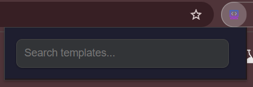
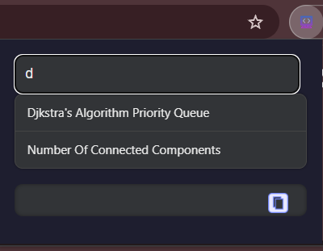
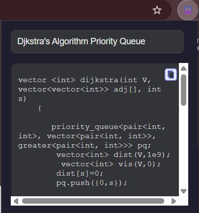

# C++ Template Chrome Extension

This Chrome extension allows users to quickly access and copy commonly used C++ code templates from a simple popup interface.

## 📁 Project Structure

```bash
Algo-Template/
├── assets/                # Screenshots and other static assets
│   └── screenshot.png
├── icons/                 # Icons used for extension & copy button
│   ├── icons8-google-code-16.png
│   ├── icons8-google-code-48.png
│   └── icons8-google-code-128.png
├── templates/             # All C++ template files
│   ├── binary_search.cpp
│   └── dijkstra.cpp
├── templates.json         # Metadata for available templates
├── manifest.json          # Chrome extension configuration
├── popup.html             # Extension UI
├── popup.js               # Logic & template loading
├── style.css              # Styling for the popup
└── README.md              # You're here!
```
## 📸 Preview

<p align="center" style="margin-bottom: 20px;">
  
</p>
<p align="center" style="margin-bottom: 20px;">
  
</p>
<p align="center" style="margin-bottom: 20px;">
  
</p>


##  Installation

###  Load the extension manually

1. Clone or download this repository.
2. Open Chrome and go to `chrome://extensions`.
3. Enable **Developer mode** (top right).
4. Click **Load unpacked** and select the `Algo-Template` folder.

## 💡 How to Add More Templates

1. Place your `.cpp` file inside the `templates/` folder.
2. Add a new entry to `templates.json`:

```json
{
  "name": "Your Algorithm Name",
  "file": "templates/your_file.cpp"
}
```
3. Reload the extension.

## Example templates.json
```
[
  {
    "name": "Binary Search",
    "file": "templates/binary_search.cpp"
  },
  {
    "name": "Dijkstra's Algorithm",
    "file": "templates/dijkstra.cpp"
  }
]
```


